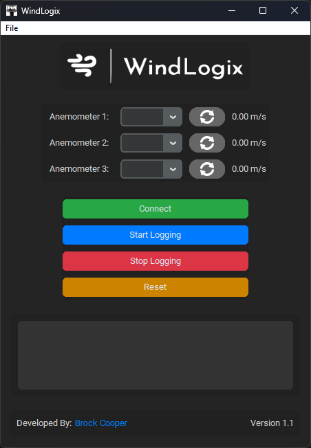

# WindLogix 🍃
WindLogix is a Graphical user interface written in python designed for measuring upto 3 [WindSoinic 75](https://gillinstruments.com.au/product/windsonic-75/) Anemometers from Gill Instruments. It allows the user to connect using an RS-232 serial to USB adaptor. The interface displays the live readings of the windspeed in m/s and can record the readings which are then logged to a CSV file within a folder called '_WindLogix Logs_' located in the `Windlogix.exe` root directory.

For more information see the help section in the interface.

There is an `auto_exe_builder.py` file that allows you to compile and build the executable to run on machines that don't have python installed. This uses the pyinstaller pyhton library. Once the executable is built, the images folder needs to be in the root directory with the exectuable in order to run. Without the images folder the exectuable will fail to run. 

# requirements.txt

- customtkinter==5.2.2
- darkdetect==0.8.0
- et-xmlfile==1.1.0
- future==1.0.0
- iso8601==2.1.0
- openpyxl==3.1.2
- packaging==24.0
- pillow==10.2.0
- pyserial==3.5
- PyYAML==6.0.1
- pyinstaller==5.13.2
- CTkMessagebox==2.5
- pywinstyles==1.7